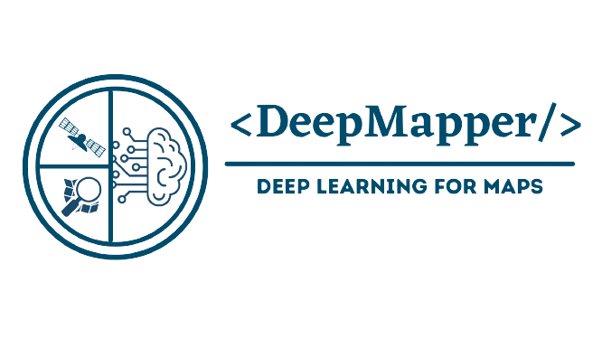

# DeepMapper
Deep Learning for Maps



DeepMapper is a cutting-edge automated mapping solution designed specifically for OpenStreetMap. Leveraging the power of deep learning, specifically Generative Adversarial Networks (GANs), this project offers a robust framework for extracting and classifying objects from remote sensing imagery, enhancing the accuracy and efficiency of automated mapping processes.

## Key Features:
- Spatial Data Crawling
- OSM-GAN for change detection
- Poly-GAN for regularization
- Change Verification
- OSM-acceptable changeset creation

## How to Use:
- Clone the repository: `git clone https://github.com/yourusername/DeepMapper.git`
- Install dependencies: `pip install -r requirements.txt`
-Follow the detailed instructions in the documentation for setting up and running DeepMapper.

## Citation
```
@phdthesis{niroshan2023,
    title        = {Automating the Crowd-Mapping Workflow with Deep Learning},
    author       = {Lasith Niroshan},
    year         = 2023,
    month        = {July},
    address      = {},
    note         = {Available at \url{https://arrow.tudublin.ie/}},
    school       = {Technological University Dublin},
    type         = {Doctoral thesis}
}
```
